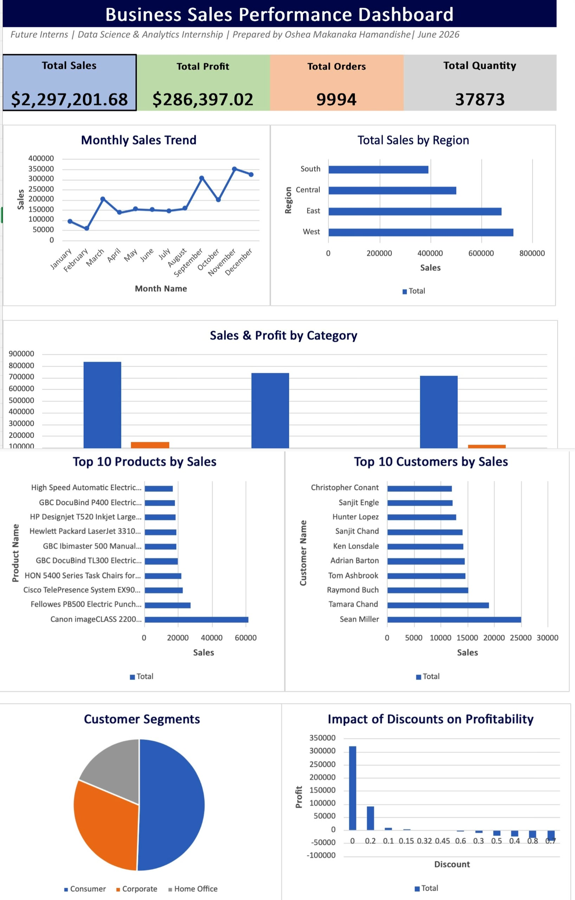

# 📊 Business Sales Performance Analytics

## Future Interns – Data Science & Analytics Internship (Task 1)

## Dashboard Preview

### Project Overview

This project was completed as part of the Future Interns Data Science & Analytics Internship.

The objective was to analyze business sales data using Microsoft Excel to identify sales trends, profitability, customer behavior, and regional performance. An interactive dashboard was created to help business owners make data-driven decisions.

---

## Objectives

- Analyze monthly sales performance
- Identify top-selling products
- Analyze sales and profit by product category
- Compare sales across different regions
- Identify top customers
- Evaluate the impact of discounts on profit
- Build a client-ready dashboard
- Generate business insights and recommendations

---

## Tools Used

- Microsoft Excel
- Pivot Tables
- Pivot Charts
- Excel Dashboard
- Canva (Business Report)

---

## Dataset

Sample Superstore Dataset

---

## Dashboard KPIs

- Total Sales
- Total Profit
- Total Orders
- Total Quantity

---

## Dashboard Visualizations

- Monthly Sales Trend
- Sales & Profit by Category
- Sales by Region
- Customer Segment Analysis
- Top 50 Products
- Top 50 Customers
- Discount Analysis

---

## Key Business Insights

- Sales performance differs across regions.
- A small number of products generate a large share of revenue.
- Discounts can reduce profitability if not managed carefully.
- Some customer segments contribute more revenue than others.
- Interactive dashboards make business performance easier to monitor.

---

## Business Recommendations

- Focus on high-performing products.
- Optimize discount strategies.
- Invest more in high-performing regions.
- Strengthen customer retention initiatives.
- Use historical sales trends to improve inventory planning.

---

## Repository Contents

- Business_Sales_Performance_Analytics.xlsx
- Business_Report.pdf
- Dashboard.jpeg
- Sample-Superstore.csv

---

## Skills Demonstrated

- Data Cleaning
- Data Analysis
- Business Analytics
- KPI Analysis
- Dashboard Design
- Data Visualization
- Business Storytelling

---

## Author

**Oshea Makanaka Hamandishe**

Electrical Engineering Student | Aspiring Data Analyst

Future Interns Data Science & Analytics Internship – 2026
